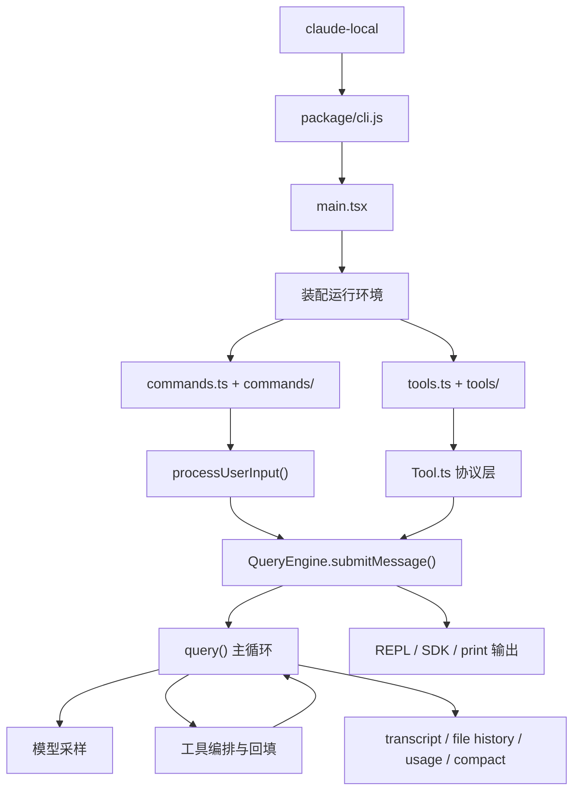

# 🌌 JackProAi-claudecode: Local Deployment Edition

> 👨‍💻 **关于技术分享**
> * **修改者:** JACK杰
> * **微信公众号:** JACK带你玩Ai （持续更新AI内容）
> * **抖音/B站/小红书频道:** JACK的AI视界

📖 [Read the English Documentation](./README.md)

---

> ⚠️ **核心声明**
> 这是一个基于 `2026-03-31` 代码泄露及 Source Map 还原内容深度整理出的 Claude Code 本地部署版本。
> 本仓库为**非官方整理版本**，设立初衷纯粹用于本地部署实践与前沿 AI 架构研究。

---

## 🛠️ 环境依赖与要求

在开始部署之前，请确保您的系统满足以下条件：
* **运行环境:** Node.js 18 或更高版本
* **模型接口:** 一个兼容 Anthropic 协议的 API 服务

---

## 🚀 极速部署指南

只需简单的几步指令即可完成本地环境的克隆与初始化：

```bash
git clone https://github.com/JackProAi/JackProAi-claudecode.git
cd JackProAi-claudecode
Set-ExecutionPolicy RemoteSigned -Scope CurrentUser
.\claude-local.ps1 --init-env
```

### 🔑 核心 API 配置

环境初始化后，您需要修改仓库根目录下的配置文件来进行鉴权：

👉 **目标文件:** `claude-local.env`

如果您尚未生成该文件，请先执行环境初始化命令：

```bash
.\claude-local.ps1 --init-env
```

打开 `claude-local.env`，将其中的占位符替换为您真实的 API 密钥：

```bash
ANTHROPIC_AUTH_TOKEN=paste_your_api_key_here
```

---

## 💡 快速配置示例

你可以学我这样
我是在硅基流动的API，然后选择了KIMI模型。你也可以换成自己喜欢的模型API。
🔗 [硅基流动专属邀请链接](https://cloud.siliconflow.cn/i/mCXH4rCe)  可复制我的专属邀请链接

硅基流动上面有很多不同厂家的模型。也有免费的API可以用，看你自己喜欢。

```bash
# siliconflow example:
CLAUDE_LOCAL_PROVIDER=siliconflow
ANTHROPIC_AUTH_TOKEN=paste_your_api_key_here
# Optional advanced overrides:
ANTHROPIC_BASE_URL=https://api.siliconflow.cn
ANTHROPIC_MODEL=moonshotai/Kimi-K2-Instruct-0905
ANTHROPIC_SMALL_FAST_MODEL=moonshotai/Kimi-K2-Instruct-0905
```

> 💡 **建议:** 建议新手下载CODEX，让它读REDME文件帮你部署。

---

## 💻 命令行操控艺术

本项目提供了灵活的终端启动方式，满足不同场景的调试需求：

### 🔍 检查启动器版本
```bash
./claude-local --version
```

### 💬 启动沉浸式交互模式 (REPL)
```bash
./claude-local --bare
```

### ⚡ 执行极速单次请求
```bash
./claude-local -p "只回复：hello" --bare --output-format text
```

---

## 📂 项目工程结构

清晰的目录架构是深入理解该项目的基础：

```text
JackProAi-claudecode
├── claude-local
├── package/
│   ├── cli.js
│   └── package.json
├── restored-src/
│   └── src/
│       ├── main.tsx
│       ├── QueryEngine.ts
│       ├── Tool.ts
│       ├── commands.ts
│       ├── tools.ts
│       ├── commands/
│       ├── tools/
│       ├── components/
│       ├── services/
│       └── utils/
└── extract-sources.js
```

---

## 🧠 Claude Code 底层架构深度解析

不要被简单的命令行表象所迷惑。从整体来看，ClaudeCode 绝对不是“一个包裹着大模型的简单脚本”，而是一套高度精密、分层的 **Agent Runtime (智能体运行时)**。

以下是其最核心的七大架构层级解析：

### 1️⃣ 启动与装配层 (Bootstrapping)
* **运行入口:** `package/cli.js` 是打包后的实际执行起点。
* **系统引导:** `restored-src/src/main.tsx` 是真正的启动大脑。它扮演着“系统引导器”的角色，负责解析 CLI 参数、加载认证与策略规则、初始化各类插件/Skills/MCP 以及 Agent 定义，最终构建出命令池与工具池，并平滑进入交互模式或静默打印模式。

### 2️⃣ 动态命令层 (Command System)
由 `restored-src/src/commands.ts` 及同名目录驱动。
这不仅包含基础的 `/review`, `/mcp`, `/plan` 等指令，更具备修改后续会话状态的高级能力（如切换底层模型、修改权限机制、重载插件甚至改写上下文）。这意味着 Claude Code 是罕见的**“命令系统 + 模型系统”双轨并行架构**。

### 3️⃣ 工具矩阵层 (Tool Assembly)
由 `restored-src/src/tools.ts` 主导。
它并非直接执行所有繁杂逻辑，而是预先将环境中的可用能力（如 `BashTool`, `FileReadTool`, `WebFetchTool` 以及高阶的协作工具如 plan/worktree 等）组织成一个受控的“统一工具池”，然后再安全地交付给模型调用。

### 4️⃣ 工具执行协议层 (Tool Protocol)
定义于 `restored-src/src/Tool.ts`。
这是整个安全的基石。工具的调用并非裸函数执行，而是裹挟着极度严谨的完整上下文（涵盖权限状态、AppState 读写、中断控制、MCP 资源流转等）。这印证了设计的核心：关键不在于“具备什么工具”，而在于“如何绝对受控地调用工具”。

### 5️⃣ 会话控制中枢 (Session Execution)
`restored-src/src/QueryEngine.ts` 是这里的绝对核心。
它的主要职责是通过 `submitMessage()` 将用户的碎片化输入转化为完整连贯的 Agent Turn。它处理系统提示词构建、内存与附件管理，并精确维护会话级别的成本(cost)、用量(usage)及权限记录。与其说是 API 包装器，不如称其为**“高级会话控制器”**。

### 6️⃣ 模型采样与编排引擎 (Orchestration Loop)
`restored-src/src/query.ts` 承载了最底层的 Agent 主循环。
这里发生了真正的“魔法”：从上下文的动态压缩(Context Collapse)发起模型采样、精准识别 `tool_use` 块，到执行回调、填补结果并监控 Token 预算。它本质上就是整个系统的 **Agent Orchestration Engine**。

### 7️⃣ 基础设施与 UI 表现层 (Infrastructure & UI)
涵盖了 `components/`, `services/`, 和 `utils/` 目录。
负责呈现精美的终端 UI 渲染，同时默默处理后台的 API/MCP 集成、会话持久化备份以及 Git 辅助分析。交互界面与 Headless 模式完美共享了同一套强悍的底层核心。

---

## 🕸️ 核心调用链路图谱



---

## 🎯 架构一句话总结

> Claude Code 的灵魂决不是单薄的 `cli.js`，而是由 `main.tsx` (装配系统)、`QueryEngine.ts` (会话管理) 与 `query.ts` (Agent 循环) 共同构筑的三位一体协作架构。
> 
> 从工程设计的维度审视，它更像是一个驻扎在终端内部的 “Agent 操作系统”，而远非一个只会调用 Bash 的高级聊天机器人。
